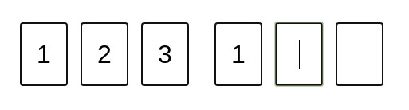

# singleDigitInput
### Small utility to controll single char input field. Works well on desktop and mobile devices.
Supports ```paste``` event with ```Ctrl+C```. After paste event fired, the callback function executes.

Visually it looks something like this. After filling up all the inputs a callback function executes.



Run ```npm i sinchar``` to install as npm package.

#### OR

Embed it via script tag

```<script src="https://unpkg.com/sinchar@latest/dist/index.js"></script>```

### Usage
Imagine structure like this:
```html
<div class="inputs-div">
  <input class="my-input" maxlength="1">
  <input class="my-input" maxlength="1">
  <input class="my-input" maxlength="1">
  <input class="my-input" maxlength="1">
  <input class="my-input" maxlength="1">
  <input class="my-input" maxlength="1">
  <input type="hidden" id="final-value">
</div>
```

It has 6 inputs for typing in 1 digit per input. For exapmle it can be authorization sms code.

Create instance and pass options object.
After instance is created, run ```.processCodeInput(callback)``` method. This will initialize all the keyboard events.
Please notice, that you have to pass the final value argument to the callback result as shown in example below.
```javascript
const options = {
  selector: '.inputs-div > .my-input',
  hiddenInputId: 'final-value',
  fillRecievedValue: true
}
const sch = new SinChar(options);
sch.processCodeInput((res) => {
  // res is the final value
  // Here is your code...
});
```

Options:

Option | Type | Required | Description
-------|------|----------|------------
```selector``` | string | yes | CSS selector to pick all inputs. It is a ```querySelectorAll``` underhood.
```hiddenInputId``` | string | yes | ID attribute of a hidden input. This input stores all the digits we entered.
```fillRecievedValue``` | boolean | yes | If true, inputs will be filled in case ```hiddenInput``` input value is not empty.
```filledClass``` | string | no | Name of a class to decorate filled input. This is optional parameter.
```numbersOnly``` | boolean | no | If ```true``` only numbers allowed. Default is false.
```autofocus``` | boolean | no | If ```true``` first input will be fucused automatically. Default is false.